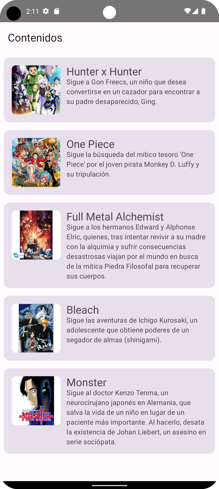
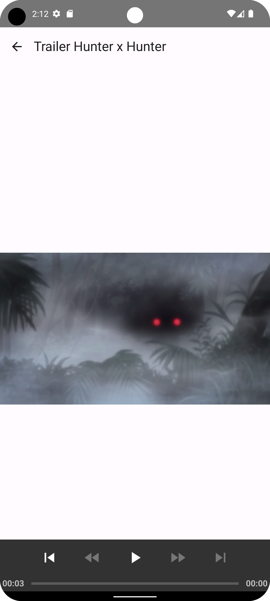
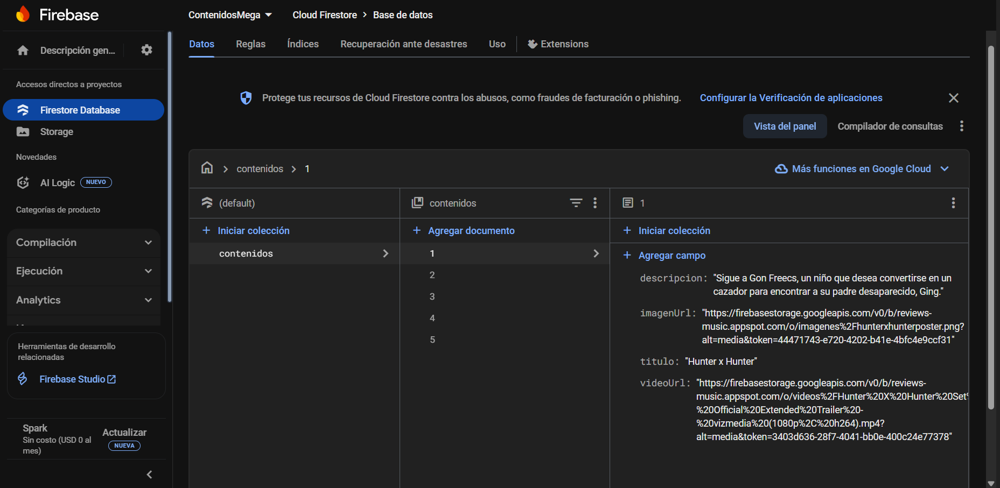

## __CONTENIDOS MEGA__

### __ABOUT__

### App to list content from a remote server with firebase and exoplayer

* List of content available
* click in card to load video
* reload content with SwipeRefresh

### Json to load content in FireStore Database
data in file contenidos.json

### images an videos located in external app with Storage, Google doesn't allow me to use Storage for free.

### Contenidos

### VideoTrailer

### FireStoreDatabase
